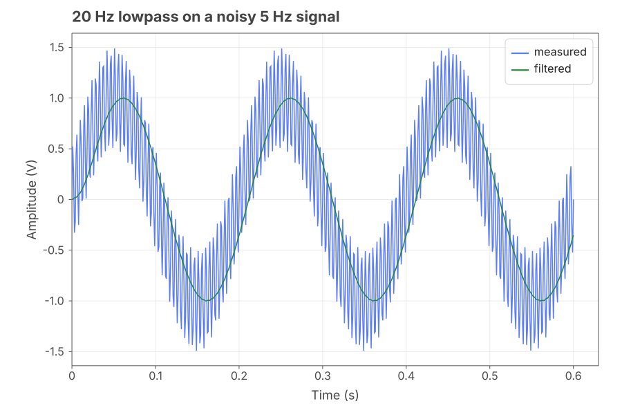
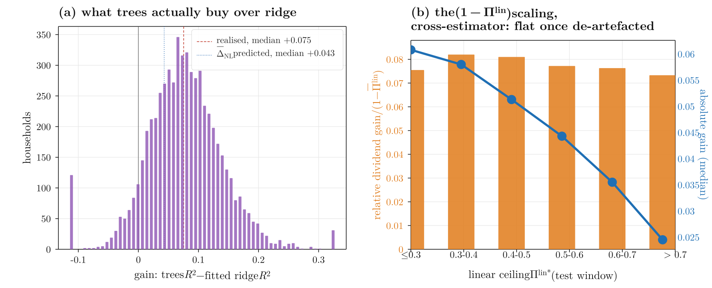
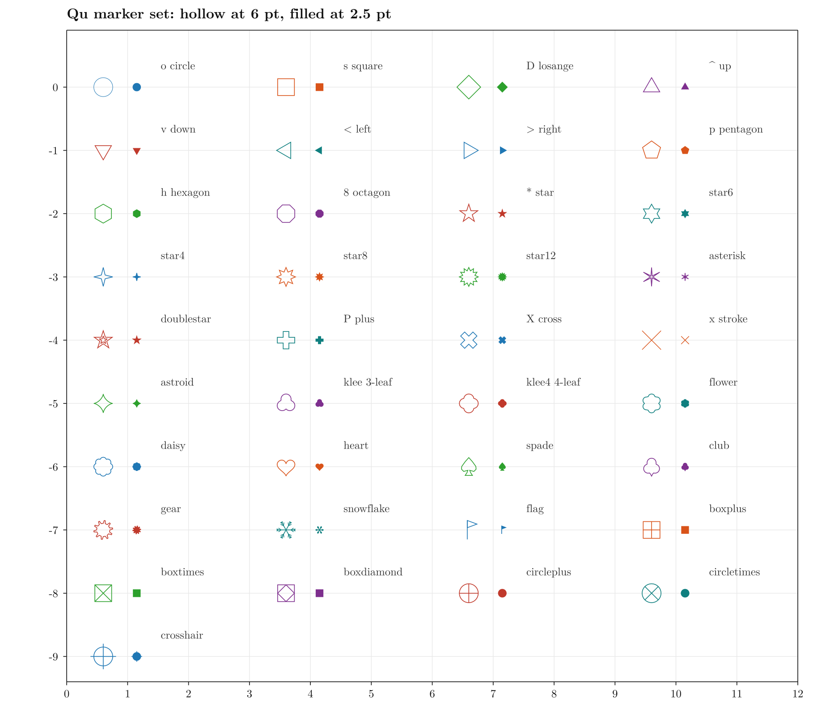
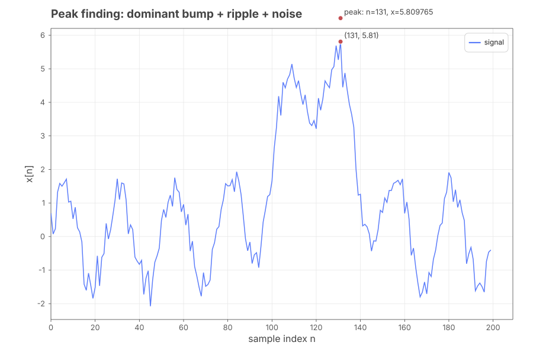
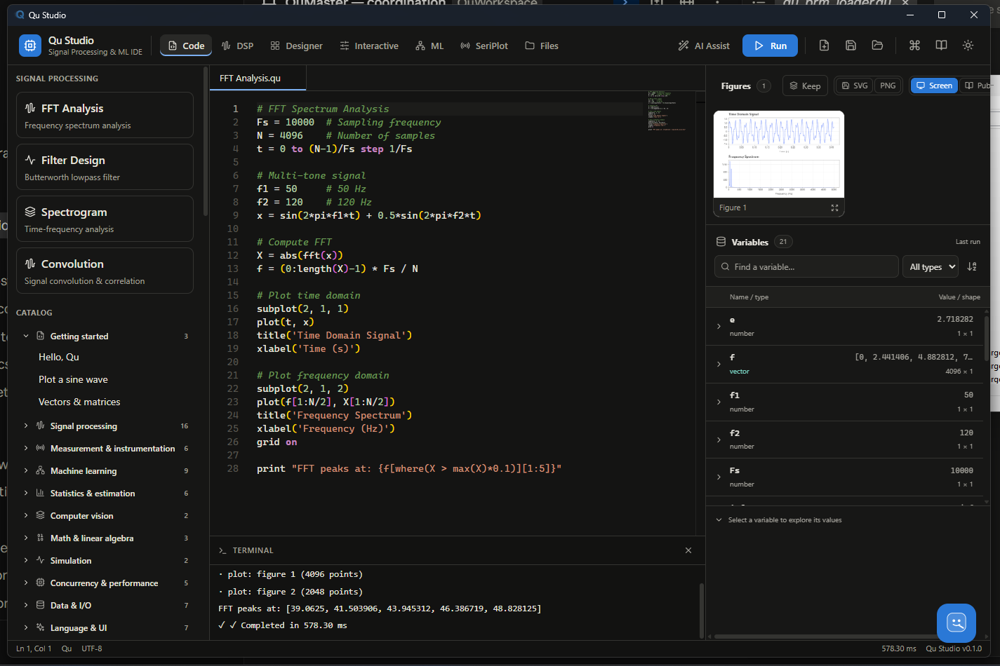
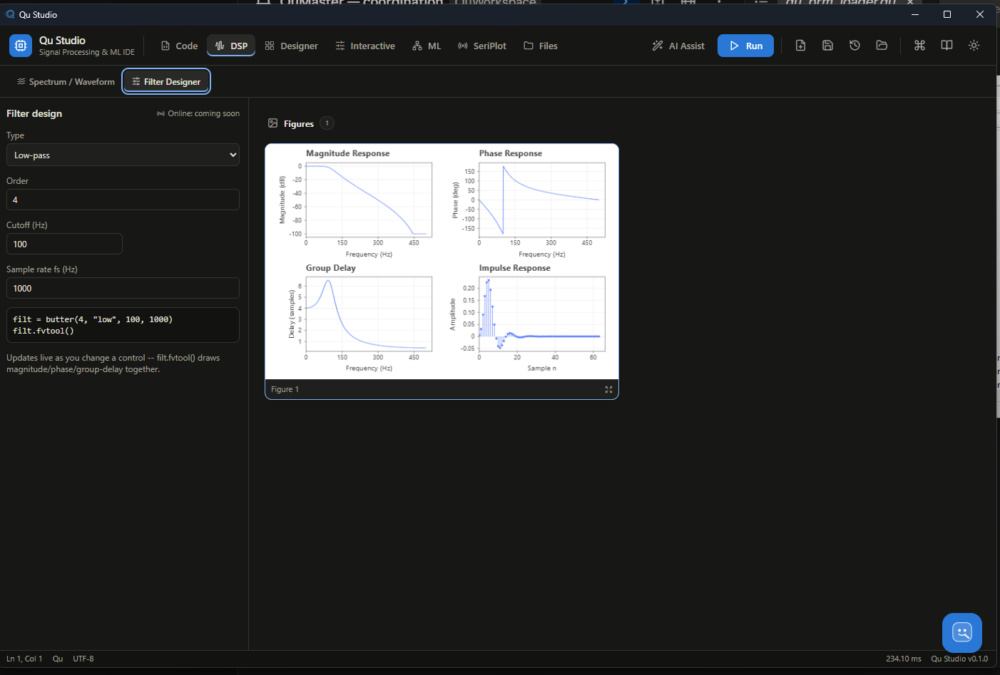
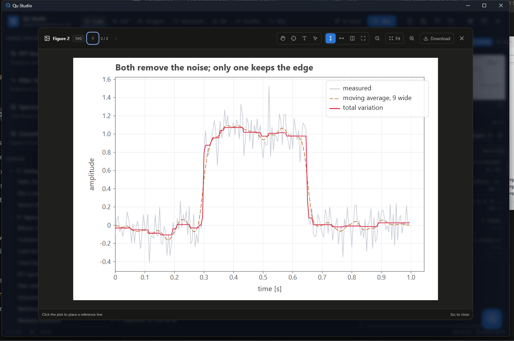

<p align="center">
  
</p>

<h1 align="center">Qu</h1>

<p align="center">
  <a href="LICENSE"></a>
  
  
</p>

An array language for measurement science: signals, spectra, impedance,
and the figures that go in the paper.

Qu is a small interpreted language with a numerical standard library and a
publication-quality plotting backend. It exists because the alternative —
prototype in one language, plot in another, and hand-transcribe the
numbers into a manuscript — puts a copy step between the computation and
the claim, and that step is where results go wrong.

One engine, one syntax, for the work that usually gets split across three
tools: **signal processing** (filters, spectra, transforms), **numerical
computation** (dense linear algebra, real and complex), **testing an
algorithm against another** (same seed, same data, a real number
either way), **a sandbox that fails loudly instead of quietly** (an
unread keyword, a shape mismatch, a singular matrix — errors, never
guesses), and **machine learning** (classic algorithms today, a fuller
platform on the roadmap). Prototype, measure, and plot it without
leaving the language, or the REPL.

```qu
# A noisy tone, filtered, measured and plotted — all of it here.
fs = 1000
t  = (0 to 999) / fs
y  = sin(2 * pi * 50 * t) + 0.2 * randn(1000, seed = 1)
lp = butter(4, "low", 120, fs)
z  = filtfilt(lp, y)
print("residual rms {rms(z - sin(2 * pi * 50 * t)):.4f}")

theme("publication")
plot(t[0:400], z[0:400], color = "#0072BD", lw = pt(0.8))
xlabel("time $t$ [s]")
ylabel("amplitude")
savefig("filtered.pdf")
```

## Contents

- [What it has](#what-it-has)
- [Gallery](#gallery)
- [Qu Studio](#qu-studio)
- [Other editors](#other-editors)
- [Getting started](#getting-started)
- [Design commitments](#design-commitments)
- [Status](#status)
- [Credits](#credits)
- [Licence](#licence)

## Gallery

Real output from `catalog/`, not mockups — every figure below is a `.svg`
a Qu script actually produced, checked in as-is.

<table>
<tr>
<td width="34%">

**Filter design and response**<br>
[`demo_filter.qu`](catalog/demo_filter.qu)

</td>
<td>

</td>
</tr>
<tr>
<td width="34%">

**Independent twin axes**<br>
[`qu_twin_axis_reference.qu`](catalog/qu_twin_axis_reference.qu) —
different scales, one figure, a common EE-measurement need most
plotting libraries make awkward

</td>
<td>

</td>
</tr>
<tr>
<td width="34%">

**Marker gallery**<br>
[`catalog/qu_markers.qu`](catalog/qu_markers.qu) — the ~30 marker glyphs
mentioned above, for real, all in one figure

</td>
<td>

</td>
</tr>
<tr>
<td width="34%">

**Peak finding**<br>
[`engine/examples/peak_finding.qu`](engine/examples/peak_finding.qu)

</td>
<td>

</td>
</tr>
</table>

More in [`catalog/`](catalog/) — around a hundred complete, runnable
scripts, each one a self-contained example.

## Five things people actually use it for

**Mathematical computation.** Dense linear algebra, real and complex, no
separate import or setup:

```qu
A = [4, -2; 1, 1]
e = eig(A)
print("eigenvalues: {e.values}")

U = svd(A)
recon_error = norm(U.u * diag(U.s) * U.vt - A)
print("SVD reconstruction error: {recon_error:.2e}")
```

**Machine learning.** Classic algorithms, a real train/test split, a real
accuracy number — not a toy:

```qu
n = 60
class0 = randn(n, 2) + [2, 2]
class1 = randn(n, 2) + [-1.5, -1.5]
X = vstack(class0, class1)
y = [zeros(n), ones(n)]

split = train_test_split(X, y, test_size=0.3, seed=7)
model = knn_model(split.X_train, split.y_train, 5, kind="classification")
pred  = model.predict(split.X_test)

accuracy = length(where(pred == split.y_test)) / length(pred)
print("test accuracy: {accuracy:.3f}")
```

**Testing an algorithm against another.** `seed=` makes every random draw
reproducible, so "which method is actually better" is a real comparison
on identical data, not noise:

```qu
rf  = random_forest_model(split.X_train, split.y_train, 100, seed=7)
knn = knn_model(split.X_train, split.y_train, 5, kind="classification")

rf_acc  = length(where(rf.predict(split.X_test) == split.y_test)) / length(split.y_test)
knn_acc = length(where(knn.predict(split.X_test) == split.y_test)) / length(split.y_test)
print("forest: {rf_acc:.3f}, k-NN: {knn_acc:.3f} -- same split, same seed, a real answer")
```

**A sandbox that won't lie to you.** An unread keyword argument, a shape
mismatch, a non-positive-definite matrix — Qu errors instead of guessing,
so a script that runs is a script whose numbers you can trust. See
[Design commitments](#design-commitments) below; this is the one thing
the whole language is organised around.

**A testbed for real signals.** Qu Studio's DSP Workbench and the `qu
repl` are built for the loop this actually is: change one parameter,
re-run, look at the number and the figure together, repeat — not
edit-save-switch-window-look.

## What it has

**Numerics.** Real and complex scalars, vectors and matrices. FFT, filter
design and application, resampling, windows, spectral estimates. Dense
linear algebra — LU, QR, SVD, Cholesky, eigen, pseudo-inverse, least
squares — on real *and* complex matrices. `nnls`, nonlinear
`least_squares` with box bounds, optimizers, root finders.

**Plotting that ends in a figure, not a screenshot.** SVG, PDF with
embedded and subset fonts, and TikZ. Maths in labels (`$\eta_{\mathrm
{exc}}$` sets the way LaTeX would, variables italic and operators
upright), twin axes with independent scales, contours, error bars,
colorbars, thirty-odd marker glyphs.

**Data in the shapes instruments produce it.** MATLAB `.mat` files read
natively, CSV with the provenance headers instruments emit, raw binary
arrays and structs, images.

**The rest.** Tables, statistics, a machine-learning set (SVM, forests,
gradient boosting, k-NN, PCA, GMM, MLPs), parallel `pmap`/pools, GPU
matmul, serial and TCP I/O.

## Qu Studio

A desktop IDE (Tauri + Rust, bundles its own engine build) for when a
terminal and a text editor aren't the whole workflow: a code editor with
live run, a visual GUI designer for building instrument-panel-style
front ends without hand-writing layout code, a DSP workbench for
interactive filter/spectrum exploration, and a figure/report browser for
the plots a script produces. It is optional — everything Qu does is
equally reachable from `qu run`/`qu repl` on the command line — but it's
where the language and the plotting backend are meant to be felt working
together, not just described.

<table>
<tr>
<td width="34%">

**Code editor**<br>
Run and re-run, figures and variables inspectable live alongside the
script that produced them.

</td>
<td>

</td>
</tr>
<tr>
<td width="34%">

**DSP Workbench — Filter Designer**<br>
Change a control, the magnitude/phase/group-delay/impulse-response
figure redraws — no separate plotting step.

</td>
<td>

</td>
</tr>
<tr>
<td width="34%">

**A real comparison, not a mockup**<br>
Two denoising methods on the same noisy step — moving average smooths
the edge away, total-variation keeps it. The kind of figure this
project exists to make easy.

</td>
<td>

</td>
</tr>
</table>

Source under [`qu-studio-tauri/`](qu-studio-tauri/); build it the same
way as any Tauri app (`npm install && npm run tauri build`) once the
engine itself is built.

## Other editors

Not everyone wants a dedicated IDE. Three lightweight integrations live
under [`editors/`](editors/) — none published to a marketplace yet, all
install locally in a couple of minutes:

| | Gives you | Install |
|---|---|---|
| [VS Code](editors/vscode-qu) | Syntax highlighting, run-file (▶/`Ctrl+Alt+Q`) with output streaming, live parse-error squiggles as you type | Copy the folder into your extensions directory, or package with `vsce` |
| [Sublime Text](editors/sublime-qu) | Syntax highlighting, `Ctrl+B` to run, `Ctrl+Shift+B` to check syntax only | Copy two files into Sublime's Packages folder |
| [Notepad++](editors/notepadpp-qu) | Syntax highlighting (User Defined Language), run via the built-in Run dialog or the NppExec plugin | Import one `.xml` file |

None of these fake a debugger — Qu's execution model (`qu run <file>`, a
one-shot subprocess with no persistent interpreter state) genuinely
doesn't support breakpoints or stepping today, and each integration says
so directly rather than pretending otherwise. The VS Code extension's
post-run variable dump is the honest substitute: the script's final
top-level bindings, after it finishes running, not a paused inspection.

## Getting started

```
cargo build --release --manifest-path engine/Cargo.toml
engine/target/release/qu run catalog/demo_hello.qu
engine/target/release/qu repl
```

The [book](book/src/SUMMARY.md) is the place to start reading: a guided
tour, three fundamentals volumes, and a standard-library reference
organised by domain.
[`docs/qu-language-spec.built.md`](docs/qu-language-spec.built.md) is the
normative specification, built directly from the working engine so it
cannot claim a feature that doesn't exist.

[`catalog/`](catalog/) holds around a hundred worked scripts, each one a
complete program that runs.

## Design commitments

These are the things Qu will not trade away, stated so you can hold it to
them.

**A keyword the callee never reads is an error.** Not ignored. Qu tracks
which style keys a builtin actually looked at and rejects the rest, so a
typo or a keyword that belongs to a sibling function cannot be silently
dropped. This is checked from the code itself, so it cannot drift out of
step with what the code does.

**A function cannot rewrite its caller's variables.** Assignment inside a
function binds locally; reads fall through to the enclosing scope; and
`global` is available when writing through is what you mean.

**Silence is the worst failure.** Where Qu can either guess or say so, it
says so — a shape mismatch, a non-positive-definite matrix, a scale that
cannot be applied. Wrong answers that look right are the failure mode this
language is organised against.

## Status

Version 0.2.1, and honest about what that means: one implementation, a
small number of users, and a specification that is ahead of the engine in
places. The numerical core is checked against reference implementations —
several ports reproduce NumPy, SciPy and MATLAB results exactly — and the
test suite runs to some 2,200 cases. It is being used for real work; it
has not yet been used for *your* real work, and that is the difference
between 0.x and 1.0.

## Credits

Vibe-coded by Ahmed Yahia Kallel, with the help of Claude Code (Opus 5,
Sonnet 5) and Qwen 3.6 (27B, 35B).

## Licence

Dual-licensed, with attribution to Ahmed Yahia Kallel required in both
halves and no non-commercial restriction:

- **Code** (the engine, `qu-core` and friends, and every `.qu` source
  file) — Apache License 2.0. See [LICENSE-APACHE](LICENSE-APACHE).
- **Docs, book prose, and the website** — Creative Commons
  Attribution-ShareAlike 4.0 (CC BY-SA 4.0). See [LICENSE-DOCS](LICENSE-DOCS).

See [LICENSE](LICENSE) for the exact split, and [NOTICE](NOTICE) for the
attribution notices Apache-2.0 requires derivative works to carry forward.
